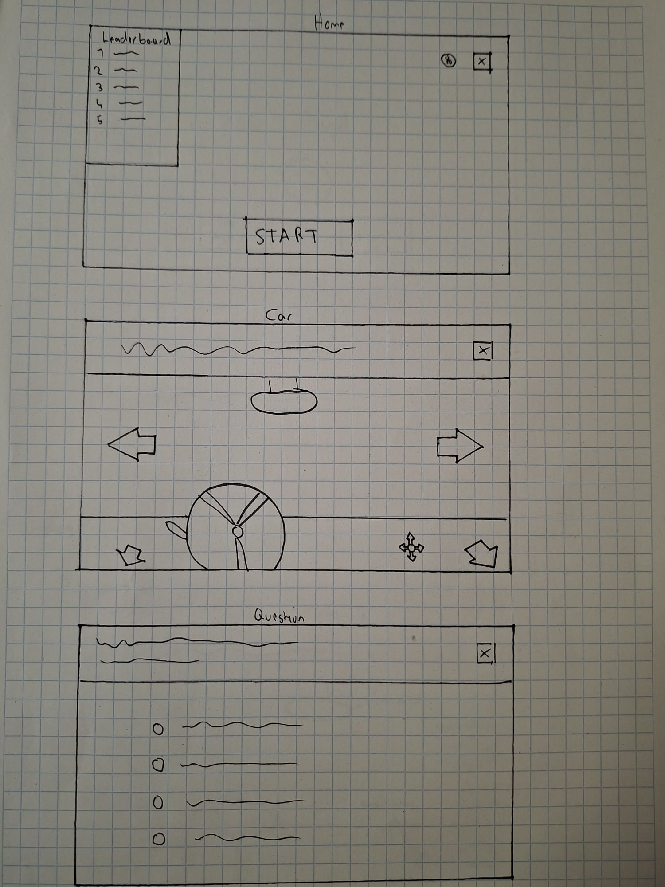
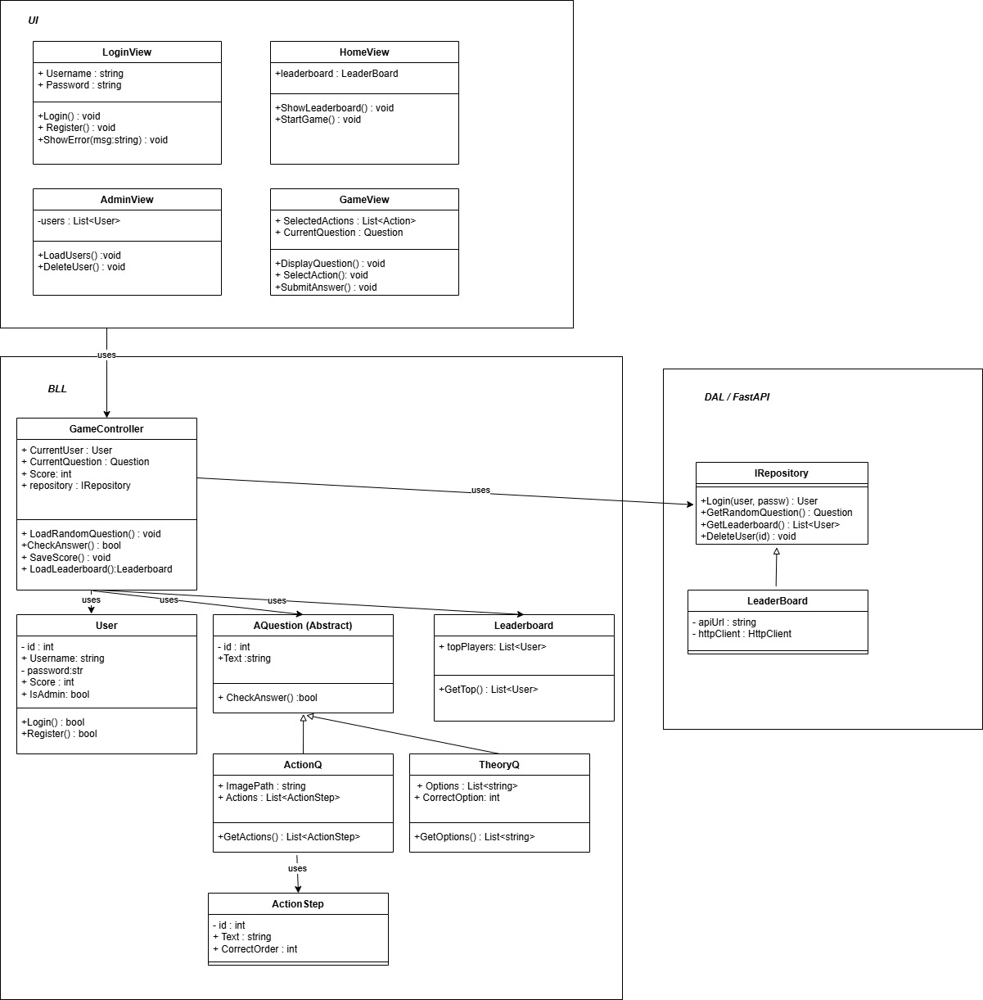
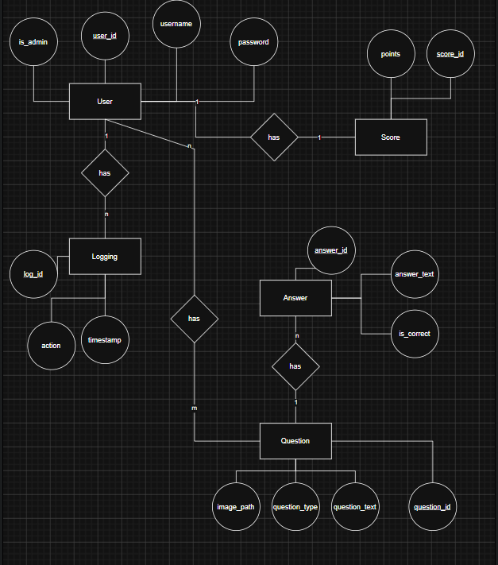

# Drive Or Die

Team
- Alina
- Franziska

GitHub-Links:
- POS: https://github.com/alinab399/DriveOrDie_POS
- DBI: https://github.com/alinab399/DriveOrDie_DBI

## Projektbeschreibung
Wir entwickeln ein Lernspiel für Fahrschüler mit WPF, FastAPI und einer Datenbank.

Im Spiel werden abwechselnd Bilder von Verkehrssituationen angezeigt und Theoriefragen gestellt. Der Benutzer muss bei den Verkehrssituationen die richtigen Schritte in der richtigen Reihenfolge auswählen, zum Beispiel:

- Blinker setzen
- Spiegel schauen
- Schulterblick machen

Die Theoriefragen sind Single-Choice und es muss die richtige Antwort ausgewählt werden.

Das Programm überprüft die Antwort und vergibt Punkte bei richtigen Antworten. Bei falschen Antworten "stirbt" man und kann erneut starten.

Benutzer können sich registrieren und einloggen. 
Es gibt einen Admin, der die Benutzer löschen und den Punktestand bearbeiten kann.
Zusätzlich gibt es ein Leaderboard mit den besten Spielern. Die Fragen und Bilder werden zufällig aus der Datenbank geladen.

**DBI:**
Domäne: Fahrschule / Verkehrsbildung

Das System verwaltet:
- Benutzer
- Theoriefragen
- Praxisfragen
- Antworten
- Punkte
- Leaderboard
- Logging

### Software-Voraussetzungen

**Für den POS-Teil (Frontend):**
- **Visual Studio:** Das brauchen wir, um die WPF-Oberfläche anzuzeigen, den C#-Code zu schreiben und das Programm zu starten.
- **.NET 10.0:** Das ist das Framework im Hintergrund, auf dem unser Spiel aufbaut.

**Für den DBI-Teil (Backend & Datenbank):**
- **Python (Version 3.10 oder neuer):** Die Programmiersprache für unser gesamtes Backend.
- **FastAPI & Uvicorn:** Das nutzen wir, um die API-Schnittstelle (die Verbindung zum Frontend) lokal als Server laufen zu lassen.
- **SQLAlchemy:** Das ist unser Tool, mit dem der Python-Code ganz einfach mit der Datenbank redet.
- **SQLite:** Unsere gewählte Datenbank. Das Praktische hier ist, dass sie dateibasiert ist – man braucht also keinen extra Datenbank-Server installieren, da die DB direkt als Datei im Projekt liegt.
- **PyCharm oder VS Code:** Als Code-Editor, um den Backend-Code zu bearbeiten und die API zu starten.

## GUI Scribbles

## UML Diagramm

## ERM Diagramm

## RM Diagramm

## Normalformen
**1NF**
- Alle Tabellen besitzen:
  - [x] eindeutige Primärschlüssel
  - [x] atomare Werte
  - [x] keine mehrfachen Werte in einer Spalte

**2NF**
- [x] Alle Nicht-Schlüsselattribute hängen vollständig vom Primärschlüssel ab.
- [x] Keine Teilabhängigkeiten vorhanden.

**3NF**
- [x] Keine transitiven Abhängigkeiten vorhanden.

- [x] Daten sind logisch getrennt:
  - Benutzer
  - Fragen
  - Antworten
  - Logging
  - Scores

## Must-Haves
### POS:
- [x] Main-Page
- [x] Login
- [x] Registrieren
- [x] Home mit Leaderboard
- [x] Praxisübungen(Car)
- [x] Theorieübungen(Question)
- [x] Logging POS
- [x] UniTests
  
### DBI:
- [x] Logging DBI
- [x] Benutzer (Es können Benutzer erstellt werden und sich dann anmelden)
- [x] Theoriefragen (werden random aus der DB geladen)
- [x] Praxisfragen (werden random aus der DB geladen)
- [x] Antworten (werden mitgespeichert und in die Anwendung übergeben)
- [x] Punkte (werden den Benutzern zugeteilt nach richtig beantworteten Fragen)
- [x] Leaderboard (für die Benutzer mit den meisten Punkten)
  

## Nice-To-Haves
### POS:
- [x] Robot-Test
- [x] Info_Pages
- [x] Todesseite
- [ ] Anbindung an Google Maps

### DBI:
- [x] Suche im Leaderboard nach Namen
- [x] Limit Leaderboard erste 10 Plätze

## Zeitplan

| Zeitraum | Aufgabe | Zuständig | Milestone |
|---|---|---|---|
| 13.05 – 14.05 | Projektplanung POS, UI-Skizzen, UML-Diagramm, Projektstruktur | Alina + Franziska | Frontend-Planung fertig |
| 15.05 – 19.05 | Projektplanung DBI, ERM und RM erstellen  | Franziska + Alina | Backend-Planung fertig |
| 18.05 – 19.05 | WPF Grundlayout erstellen (Login, Registrieren, Home) | Alina  | Basis-UI vorhanden |
| 18.05 – 19.05 | WPF Grundlayout erstellen (Car, Question, Main  ) |  Franziska | Basis-UI vorhanden |
| 20.05 – 23.05 | FastAPI Grundstruktur + Datenbankanbindung | Franziska + Alina | Backend läuft |
| 20.05 – 23.05 | Login und Registrierung implementieren | Alina + Franziska| Login-System funktioniert |
| 24.05 – 29.05 |  Theoriefragen erstellen | Alina | Theorie fertig |
| 24.05 – 29.05 |  Praxisfragen erstellen | Franziska | Praxis fertig |
| 24.05 – 29.05 | Theoriefragen aus Datenbank laden | Alina | Theoriefragen dynamisch |
| 24.05 – 29.05 | Praxisfragen aus Datenbank laden | Franziska | Praxisfragen dynamisch |
| 30.05 | Demo für Zwischenpräsentation fertigstellen | Franziska + Alina | Zwischenpräsentation bereit |
| 31.05 | Funktionierende Zwischenpräsentation | Franziska + Alina | Zwischenpräsentation |

## Nach der Zwischenpräsentation

| Zeitraum | Aufgabe | Zuständig | Milestone |
|---|---|---|---|
| 31.05 – 02.06 | Punkte-System implementieren | Alina | Punkte werden gespeichert |
| 31.05 – 02.06 | Todesseite entwickeln | Franziska | Death-System fertig |
| 31.05 – 02.06 | Robot-Test implementieren | Franziska | Nice-To-Have fertig |
| 31.05 – 02.06 | Info-Pages erstellen | Alina | Zusatzseiten fertig |
| 03.06 – 07.06 | Leaderboard Backend entwickeln | Alina | Leaderboard funktioniert |
| 03.06 – 07.06 | Leaderboard UI erstellen | Alina | Leaderboard sichtbar |
| 03.06 – 07.06 | Adminbereich entwickeln | Franziska | Adminbereich fertig |
| 03.06 – 07.06 | Benutzer löschen + Scores bearbeiten | Franziska | Adminfunktionen fertig |
| 08.06 – 09.06 | Praxisfragen erweitern | Franziska | Mehr Fragen |
| 08.06 – 09.06 | Theoriefragen erweitern | Alina | Mehr Fragen vorhanden |
| 10.06 | Logging | Alina + Franziska | Tests |
| 10.06 – 12.06 | UI verbessern und stylen | Alina + Franziska | Finales Design |
| 11.06 – 12.06 | Fehlerbehebung | Franziska + Alina | Stabiler Build |
| 15.06 | Präsentation vorbereiten und testen | Franziska + Alina | Endpräsentation bereit |
| 17.06 | Endpräsentation | Franziska + Alina | Projektabschluss |

## Milestones

| Datum | Milestone |
|---|---|
| 14.05 | Frontend-Projektplanung abgeschlossen |
| 19.05 | Backend-Projektplanung abgeschlossen |
| 31.05 | Funktionierende Zwischenpräsentation |
| 07.06 | Leaderboard und Punkte-System fertig |
| 07.06 | Adminbereich fertig |
| 12.06 | Hauptfunktionen vollständig |
| 15.06 | Dokumentation abgeschlossen |
| 17.06 | Endpräsentation |

## KI im POS-Teil

Wir haben hauptsächlich das GUI Design und das Leaderboard von Claude Code und ChatGPT erstellen lassen, um zeitlich mit unserem Projekt fertig zu werden.
Auch bei der Fehlersuche hat KI uns geholfen.

Verwendete AI Tools:
- Claude Code
- ChatGPT

Reflexion:
Es ist nicht so leicht wie man vielleicht denkt, KI dazu zu bringen, genau das zu erstellen was man braucht und dass es in den Code passt. 
Man muss genau beschreiben, gut prompten und es erfordert in den meisten Fällen Geduld, bis das Ergebnis zufriedenstellend ist.
Das Design mit KI-Hilfe zu erstellen hat sehr gut funktioniert, nachdem man genau gepromptet hat, was man für ein Design möchte.
Fehlersuche war um einiges schwerer. Wir mussten der KI genau erklären was nicht funktioniert, unser Verdacht wo der Fehler lag und den entsprechenden Code der KI zur Verfügung stellen. Was wiederum mehr Zeit in Anspruch genommen hat.

## Probleme und Lösungen

| Problem | Ursache | Lösung |
| :--- | :--- | :--- |
| **Git-Merge-Konflikte** | Paralleles Arbeiten im Team an denselben Frontend- und Backend-Dateien. | regelmäßige Absprachen vor Push/Pull |
| **Bilder** | Programm ist abgestürtzt weil die Bilder von den Straßen nicht angezeigt werden konnten. | Bildvorgang muss auf Ressource umgestellt werden damit das Bild richtig geladen werden kann. |
| **Theorie** | Als wir die Theoriefragen zu den Praxisbeispielen implementiert haben, wurden die Daten nicht richtig aus der DB geladen und es stürzte ab. Unser Frontend hat eine andere Reihenfolge der Parameter erwartet als übergeben. | JSON mitteilen an welcher Stelle der geforderte Parameter steht damit JSON es finden kann. |
