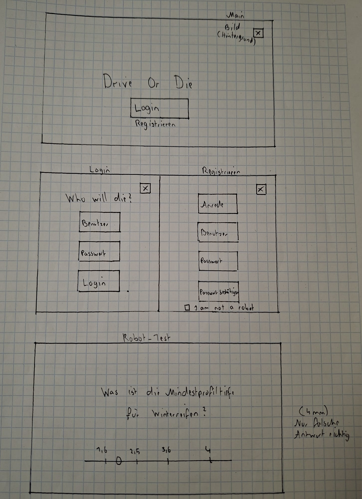
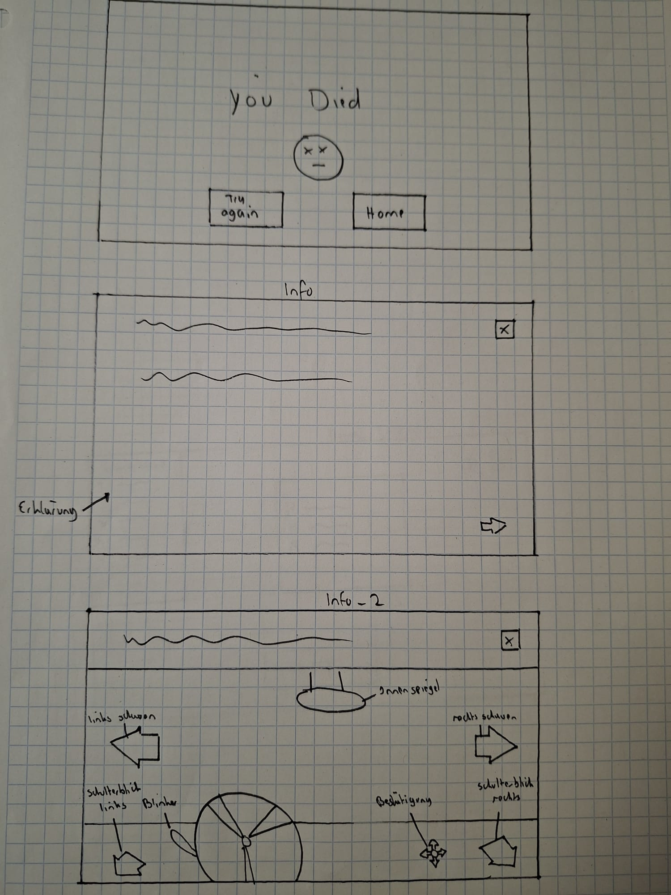
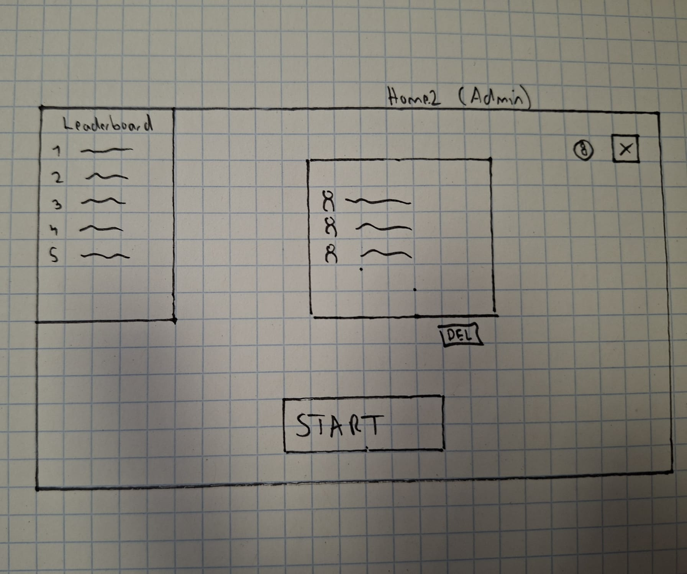
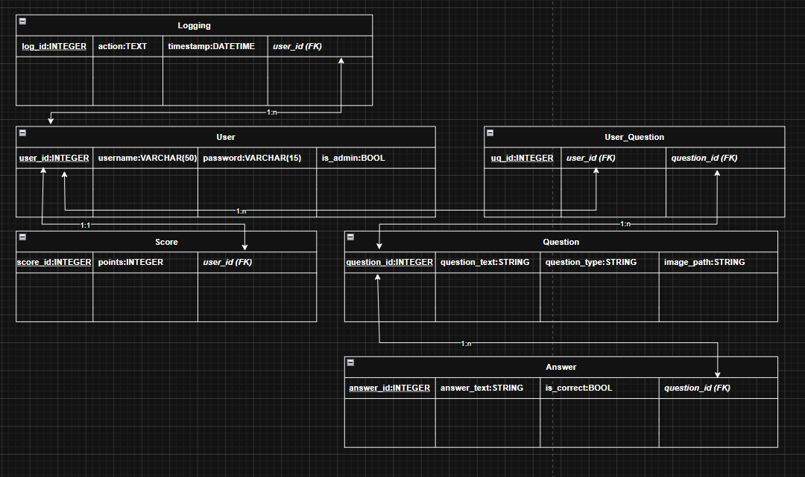

# Drive Or Die

Team
- Alina
- Franziska

GitHub-Links:
- POS: https://github.com/alinab399/DriveOrDie_POS
- DBI: https://github.com/alinab399/DriveOrDie_DBI

## Projektbeschreibung
Wir entwickeln ein Lernspiel für Fahrschüler mit WPF, FastAPI und einer Datenbank.

Im Spiel werden abwechselnd Bilder von Verkehrssituationen angezeigt und Theoriefragen gestellt. Der Benutzer muss bei den Verkehrsituationen die richtigen Schritte in der richtigen Reihenfolge auswählen, zum Beispiel:

- Blinker setzen
- Spiegel schauen
- Schulterblick machen

Die Theoriefragen sind Single-Choice und es muss die richtige Antwort ausgewählt werden.

Das Programm überprüft die Antwort und vergibt Punkte bei richtigen Antworten. Bei falschen Antworten "stirbt" man und kann erneut starten.

Benutzer können sich registrieren und einloggen. 
Es gibt einen Admin der die Benutzer löschen und den Punktestand bearbeiten kann.
Zusätzlich gibt es ein Leaderboard mit den besten Spielern. Die Fragen und Bilder werden zufällig aus der Datenbank geladen.

**DBI:**
Domäne: Fahrschule / Verkehrsbildung

Das System verwaltet:
- Benutzer
- Theoriefragen
- Praxisfragen
- Antworten
- Punkte
- Leaderboard
- Logging

## GUI Scribbles

## UML Diagramm

## ERM Diagramm

## RM Diagramm

**1NF**
- Alle Tabellen besitzen:
  - eindeutige Primärschlüssel
  - atomare Werte
  - keine mehrfachen Werte in einer Spalte

Erfüllt.

**2NF**
- Alle Nicht-Schlüsselattribute hängen vollständig vom Primärschlüssel ab.
- Keine Teilabhängigkeiten vorhanden.

Erfüllt.

**3NF**
- Keine transitiven Abhängigkeiten vorhanden.

- Daten sind logisch getrennt:
  - Benutzer
  - Fragen
  - Antworten
  - Logging
  - Scores

Erfüllt.

### Must-Haves
POS:
- Main-Page
- Login
- Registrieren
- Home mit Leaderboard
- Praxisübungen(Car)
- Theorieübungen(Question)
- Logging POS
  
DBI:
- Logging DBI
- Benutzer 
- Theoriefragen
- Praxisfragen
- Antworten
- Punkte
- Leaderboard
  

### Nice-To-Haves
POS:
- Robot-Test
- Info_Pages
- Todesseite
- anbindung an google maps

DBI:
- Suche im Leaderboard nach Namen
- Limit Leaderboard erste 10 Plätze
- Limit user tabelle für admin

## Zeitplan

| Zeitraum | Aufgabe | Zuständig | Milestone |
|---|---|---|---|
| 13.05 – 14.05 | Projektplanung POS, UI-Skizzen, UML-Diagramm, Projektstruktur | Alina + Franziska | Frontend-Planung fertig |
| 15.05 – 19.05 | Projektplanung DBI, ERM und RM erstellen  | Franziska + Alina | Backend-Planung fertig |
| 18.05 – 19.05 | WPF Grundlayout erstellen (Login, Registrieren, Home) | Alina  | Basis-UI vorhanden |
| 18.05 – 19.05 | WPF Grundlayout erstellen (Car, Question, Main  ) |  Franziska | Basis-UI vorhanden |
| 20.05 – 23.05 | FastAPI Grundstruktur + Datenbankanbindung | Franziska + Alina | Backend läuft |
| 20.05 – 23.05 | Login und Registrierung implementieren | Alina + Franziska| Login-System funktioniert |
| 24.05 – 29.05 |  Theoriefragen erstellen | Alina | Theorie fertig |
| 24.05 – 29.05 |  Praxisfragen erstellen | Franziska | Praxis fertig |
| 24.05 – 29.05 | Theoriefragen aus Datenbank laden | Franziska | Theoriefragen dynamisch |
| 24.05 – 29.05 | Praxisfragen aus Datenbank laden | Alina | Praxisfragen dynamisch |
|30.05 | Demo für Zwischenpräsentation fertigstellen | Franziska + Alina | Zwischenpräsentation bereit |
| 31.05 | Funktionierende Zwischenpräsentation | Franziska + Alina | Zwischenpräsentation |

## Nach der Zwischenpräsentation

| Zeitraum | Aufgabe | Zuständig | Milestone |
|---|---|---|---|
| 31.05 – 02.06 | Punkte-System implementieren | Alina | Punkte werden gespeichert |
| 31.05 – 02.06 | Todesseite entwickeln | Franziska | Death-System fertig |
| 31.05 - 02.06 | Robot-Test implementieren | Franziska | Nice-To-Have fertig |
|  31.05 - 02.06  | Info-Pages erstellen | Alina | Zusatzseiten fertig |
| 03.06 – 07.06 | Leaderboard Backend entwickeln | Alina | Leaderboard funktioniert |
| 03.06 – 07.06 | Leaderboard UI erstellen | Alina | Leaderboard sichtbar |
| 03.06 – 07.06 | Adminbereich entwickeln | Franziska | Adminbereich fertig |
| 03.06 – 07.06 | Benutzer löschen + Scores bearbeiten | Franziska | Adminfunktionen fertig |
| 08.06 – 09.06 | Praxisfragen erweitern | Alina | Mehr Fragen |
| 08.06 – 09.06 | Theoriefragen erweitern | Franziska | Mehr Fragen vorhanden |
| 10.06 | Logging | Alina + Franziska | Tests |
| 10.06 – 12.06 | UI verbessern und stylen | Alina + Franziska | Finales Design |
| 11.06 – 12.06 | Fehlerbehebung | Franziska + Alina | Stabiler Build |
| 13.06 | Präsentation vorbereiten und testen | Franziska + Alina | Endpräsentation bereit |
| 14.06 | Endpräsentation | Franziska + Alina | Projektabschluss |

# Milestones

| Datum | Milestone |
|---|---|
| 14.05 | Frontend-Projektplanung abgeschlossen |
| 19.05 | Backend-Projektplanung abgeschlossen |
| 31.05 | Funktionierende Zwischenpräsentation |
| 07.06 | Leaderboard und Punkte-System fertig |
| 07.06 | Adminbereich fertig |
| 12.06 | Hauptfunktionen vollständig |
| 14.06 | Dokumentation abgeschlossen |
| 14.06 | Endpräsentation |